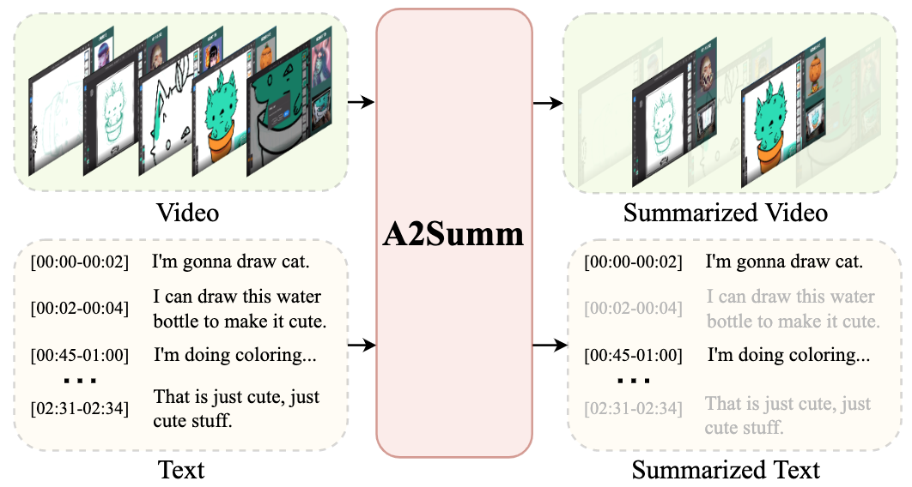
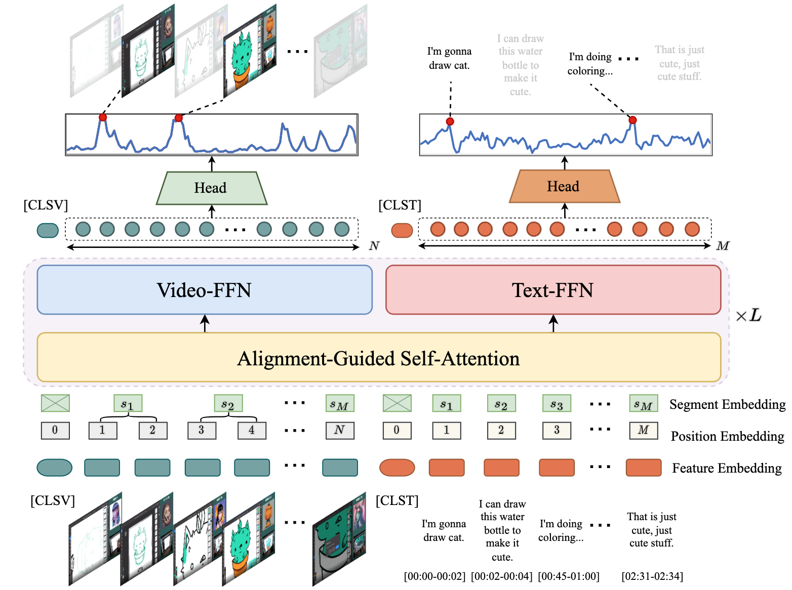

- Modified A2Summ's Github Repository
1) setup_A2Summ_gdrive.ipynb: used this to clone the repo
2) download the data folder from here(this contains generated captions): https://drive.google.com/drive/folders/1chO0yqTs0AN2P35jp9q_Xv0yXO5z6G-u?usp=sharing
3) modified train_videosumm.py, to save the identified key frames in the evaluation_videosumm function
4) A2Summ_TVSum_get_key_frames.ipynb: get extracted key frames from A2Summ model. This is stored in data/TVSum_identified_key_frames
5) A2Summ_TVSum_generate_frame_captions.ipynb: code to get captions for frames using ViT-GPT2 model. This is stored in data/TVSum_captions

In data directory(downloaded in 2nd point above):
- TVSum: original TVSum dataset given by A2Summ
- TVSum_captions:
  - frames directory: contains frames from video, for which captions have been generated
  - a2summ_captions.json: positive and negative frames and their captions, for key frames identified by A2Summ
  - captions.json: captions for all frames in the video, generated by ViT-GPT2 model
  - gt_captions.json: positive and negative frames and their captions, for the GT key frames in TVSum dataset(only of user 1, the dataset contains GT from 20 users)

- TVSum_identified_key_frames:
  - video_{i}.json: key frames identified by A2Summ model for video i


below is the original readme from A2Summ repository:

-------------------------------------------------------------------


# Align and Attend: Multimodal Summarization with Dual Contrastive Losses (CVPR2023)
### [Project Page](https://boheumd.github.io/A2Summ/) | [Paper](https://arxiv.org/abs/2303.07284)
The official repository of our paper "**Align and Attend: Multimodal Summarization with Dual Contrastive Losses**".

<p align="center">

</p>


## Model Overview
<p align="center">

</p>


## Requirements
You can install the conda environment by running:
```bash
conda create -n a2summ python=3.8.13
conda activate a2summ
pip install torch==1.12.0+cu113 torchvision==0.13.0+cu113 --extra-index-url https://download.pytorch.org/whl/cu113
pip install tensorboard
pip install rouge-score==0.1.2
pip install scipy ortools h5py pyyaml
```

## Dataset
We evaluate our A2Summ on two multimodal summarization multimodal output datasets ([CNN, Daily_Mail](https://aclanthology.org/2021.naacl-main.473.pdf)) and two standard video summarization datasets ([SumMe](https://gyglim.github.io/me/papers/GygliECCV14_vsum.pdf), [TVSum](https://www.cv-foundation.org/openaccess/content_cvpr_2015/papers/Song_TVSum_Summarizing_Web_2015_CVPR_paper.pdf)).
We also collected a large-scale multimodal summarization dataset BLiSS which consists of livestream videos and transcripts with annotated summary.
Before running the code, please download the pre-processed datasets from [google drive link](https://drive.google.com/drive/folders/1rqXEIelRzq4mb7NaBk3GXxh7jlfP_Snm?usp=share_link).
Unzip it under the `data/` folder and make sure the data structure is as below.

   ```
    ├── data
        └── BLiSS
            ├── annotation
            ├── feature
        └── CNN
            ├── annotation
            ├── feature
        └── Daily_Mail
            ├── annotation
            ├── feature
        └── SumMe
            ├── caption
            ├── feature
            ├── splits.yml
        └── TVSum
            ├── caption
            ├── feature
            ├── splits.yml

   ```
### BLiSS Dataset
For the BLiSS dataset, due to the copyright issue, we only provide the extracted video/thumbnail features instead of the original videos/thunmbnails. If you need access to the original videos, please email me (bohe@umd.edu) for the public URLs of each video.


## Running

### Training
We train the model on a single GTX-1080ti GPU. To train the model on different dataset, please execute the following command.
```bash
python train.py --dataset ${dataset}
```

### Testing
First, download the [checkpoints](https://drive.google.com/file/d/1LuXWjW3BcAXCOals4o2UUVYMx-FYnJ3T/view?usp=sharing) into "saved_model" directory and pass it as the checkpoint flag. 

```bash
python train.py --dataset ${dataset} \
    --test --checkpoint saved_model/${dataset}
```


## Citation
If you find our code or our paper useful for your research, please **[★star]** this repo and **[cite]** the following paper:

```latex
@inproceedings{he2023a2summ,
  title = {Align and Attend: Multimodal Summarization with Dual Contrastive Losses},
  author={He, Bo and Wang, Jun and Qiu, Jielin and Bui, Trung and Shrivastava, Abhinav and Wang, Zhaowen},
  booktitle = {Proceedings of the IEEE/CVF Conference on Computer Vision and Pattern Recognition (CVPR)},
  year = {2023}
}
```

## Acknowledgement
We referenced the repos below for the code
- [DSNet](https://github.com/li-plus/DSNet)
- [UMT](https://github.com/TencentARC/UMT)

